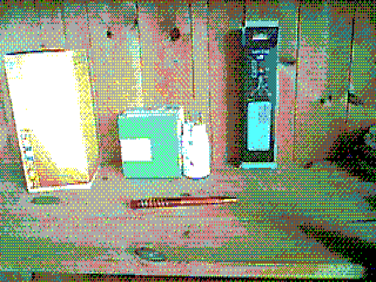

# ESP32-EGA16-TGA

This is a [ShittyCameraChallenge](https://photog.social/@ShittyCameraChallenge/110141901243083121)
contribution to shoot 16-color (not 16-bit!) pictures on the ESP32-CAM.

There is a [full write-up on the author's blog](https://op-co.de/blog/posts/esp32-ega16-tga/).

Example image:

## Configuration

There is a bunch of `#define`s in the source to enable or disable various "features" of the project:

- `WARMUP_PICS` - number of pictures to discard while AWB is calibrating
- `STORE_{RAW,RGB,TGA}` - which file formats you want to end up on the SD card
- `STORE_DITHER_*` - which dither modes you want to store (see blog post)
- `HEIGHT` - you can set that to 240 to keep the 1:1 pixel aspect ratio

**DO NOT TOUCH THE OTHER KNOBS!**
